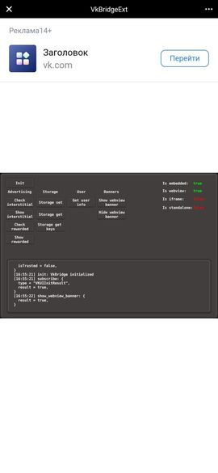

# VK Bridge for Defold

**This is an open-source project. It is not affiliated with Vkontakte LLC.**

## Installation

You can use it in your own project by adding this project as a [Defold library dependency](http://www.defold.com/manuals/libraries/). Open your `game.project` file and in the dependencies field add **a link to the ZIP file of a [specific release](https://github.com/potatojam/defold-vkbridge/tags).**

## Supported Platforms

| Platform        | Status      |
| --------------- | ----------- |
| Browser (HTML5) | Supported ✅ |

## Getting Started

* [📚 The official documentation](https://dev.vk.com/bridge/getting-started).
* [📚 Official package VK Bridge](https://github.com/VKCOM/vk-bridge).
* [💬 The Telegram chat about Defold](https://t.me/DefoldEngine) for Russian-speaking users.

## Initialization

To get started, you need to initialize the SDK using the `init` method.

```lua
local vkbridge = require("vkbridge.vkbridge")

local function init_handler(self, err)
    if err then
        print("Something bad happened :(", err)
    else
        --
        -- SDK is ready!
        -- From this moment, you can use all available functions, i.e. invoke ads, get player data, etc.
        --
    end
end

function init(self)
    vkbridge.init(init_handler)
end
```

## The `game.project` Settings

```ini
[vk_bridge]
auto_init = true
wv_banners = true
```

* `auto_init` - The application initializes the **VKBridge** on startup. To prevent **VKBridge** from being initialized, set `false`. Then the initialization will be when `vkbridge.init(init_handler)` is called.
* `wv_banners` - Loads a script containing a [WebView banner](#webview-banner).

## Lua API

VKBridge JavaScript SDK uses ES6 Promise for asynchronous operations. For Lua API promises were replaced with callback functions with arguments `(self, err, result)`, where

- `self` <kbd>userdata</kbd> - Script self reference.
- `err` <kbd>table</kbd> - Error code if something went wrong. If successful: `err = nil`.
- `result` <kbd>table</kbd> - Data if the operation should return something.

### `vkbridge.init()`

Initialize the Vk Bridge

### `vkbridge.send(name, [, data[, callback]])`

Sends a message to native client and returns the object with response data

**Parameters**

- `name` <kbd>string</kbd> _required_ The VK Bridge method
- `data` <kbd>table|nil</kbd> _optional_ Message data object
- `callback` <kbd>function</kbd> _optional_ callback with response data
 
### `vkbridge.subscribe(fn)`

Subscribes a function to events listening.
The function will handle each `vkbridge.send` and some additional events. In order not to miss events, you can subscribe before calling `vkbridge.init`.

**Parameters**

- `fn` <kbd>function</kbd> _required_ Function to be subscribed to events. `function(self, data)`

### `vkbridge.unsubscribe(fn)`

Unsubscribes a function from events listening

**Parameters**

- `fn` <kbd>function</kbd> _required_ Event subscribed function

### `vkbridge.supports(method)`

Checks if an event is available on the current device

**Parameters**

- `method` <kbd>string</kbd> _required_ The VK Bridge method

### `vkbridge.is_webview()`

Returns `true` if VK Bridge is running in mobile app, or `false` if not

### `vkbridge.is_iframe()`

Returns `true` if VK Bridge is running in iframe, or `false` if not

### `vkbridge.is_embedded()`

Returns `true` if VK Bridge is running in embedded app, or `false` if not

### `vkbridge.is_standalone()`

Returns `true` if VK Bridge is running in standalone app, or `false` if not

## Additional Lua API

All of these functions can be called with `vkbridge.send`. They are written for convenience.

### `vkbridge.check_interstitial(callback)`

Check if there is the interstitial ad available

**Parameters**

- `callback` <kbd>function</kbd> _required_ callback with response data

### `vkbridge.show_interstitial(callback)`

Show interstitial ads

**Parameters**

- `callback` <kbd>function</kbd> _required_ callback with response data

### `vkbridge.check_rewarded(callback)`

Check if there is the rewarded ad available to serve

**Parameters**

- `use_waterfall` <kbd>boolean</kbd> _required_ Whether to use the mechanism for displaying interstitial advertising in the absence of rewarded video.
- `callback` <kbd>function</kbd> _required_ callback with response data

### `vkbridge.show_rewarded(callback)`

Show rewarded ads

**Parameters**

- `use_waterfall` <kbd>boolean</kbd> _required_ Whether to use the mechanism for displaying interstitial advertising in the absence of rewarded video.
- `callback` <kbd>function</kbd> _required_ callback with response data

### `vkbridge.storage_set(key, value, callback)`

Set the value of the variable whose name is passed in the `key` parameter. `Key` life is 1 year.

**Parameters**

- `key` <kbd>string</kbd> _required_ Key name, [a-zA-Z_\-0-9]. The maximum length is 100 characters.
- `value` <kbd>string</kbd> _required_ The value of the variable. Only the first 4096 bytes are stored.
- `callback` <kbd>function</kbd> _required_ callback with response data

### `vkbridge.storage_get(key, callback)`

Return the values of the variables.

**Parameters**

- `key` <kbd>string|table</kbd> _required_ Names of keys or key [a-zA-Z_\-0-9]. Can be a table or a string
- `callback` <kbd>function</kbd> _required_ callback with response data

### `vkbridge.storage_get_keys(key, callback)`

Return the names of all variables.

**Parameters**

- `count` <kbd>number</kbd> _required_ The number of variable names to get information about.
- `offset` <kbd>number|nil</kbd> _required_ The offset required to select a particular subset of variable names.
- `callback` <kbd>function</kbd> _required_ callback with response data

### `vkbridge.get_user_info(callback)`

Allows you to get basic data about the profile of the user who launched the application

**Parameters**

- `callback` <kbd>function</kbd> _required_ callback with response data

## WebView Banner

WebView Banner is a banner which is displayed either above or below the application. It is available only for mobile devices running in the VKontakte application.



Be sure to enable **wv_banners = true** in the **game.project**.

### `vkbridge.show_wv_banner(callback)`

Show WebView banner. Calling show again will `refresh` the banner.

**Parameters**

- `callback` <kbd>function</kbd> _required_ callback with response data

### `vkbridge.hide_wv_banner()`

Hide WebView banner. Returns `true` on success.

### `vkbridge.set_wv_banner_configs(position, count)`

Set WebView banner configs.

**Parameters**

- `position` <kbd>string</kbd> _required_ Banner location. Can be `top` or `bottom`.
- `count` <kbd>number</kbd> Number of banners in a column. Default `1`

## Credits

Made by [PotatoJam](https://github.com/potatojam).

This project uses the source code of [YaGames](https://github.com/indiesoftby/defold-yagames).

For example used:

[Dirty Larry](https://github.com/andsve/dirtylarry)

[Druid](https://github.com/Insality/druid)

### License

MIT license.
